<!-- Archivo generado desde `FD03-EPIS-Informe Especificacion Requerimientos.docx` para visualizacion en GitHub. -->

**UNIVERSIDAD PRIVADA DE TACNA**

**FACULTAD DE INGENIERIA**

**Escuela Profesional de Ingeniería de Sistemas**

**Proyecto “Dashboard de análisis electoral Perú 2026”**

Curso: Inteligencia de Negocios

Docente: Mag. Patrick Jose Cuadros Quiroga

Integrantes:

**Chura Ticona, Mary Luz (2019065163)**

**Diego Chara Apaza (2019065026)**

**Tacna – Perú**

**2026**

**CONTROL DE VERSIONES**

| Versión | Hecha por | Revisada por | Aprobada por | Fecha | Motivo |
| --- | --- | --- | --- | --- | --- |
| 1.0 | MPV | ELV | ARV | 10/10/2020 | Versión Original |

# Sistema {Nombre del Sistema}

# Documento de Especificación de Requerimientos de Software

# Versión {1.0}

**CONTROL DE VERSIONES**

| Versión | Hecha por | Revisada por | Aprobada por | Fecha | Motivo |
| --- | --- | --- | --- | --- | --- |
| 1.0 | EDCA | MTC | PJCQ | 27/06/2026 | Versión Original |

# INTRODUCION

# El presente documento describe de manera detallada los requerimientos del sistema denominado Dashboard de análisis de su perfil socioeconómico, legal y de campaña. El objetivo del sistema es facilitar el análisis de información electoral mediante herramientas de inteligencia de negocios, específicamente a través de dashboards interactivos desarrollados en Power BI.

# Este documento establece los requerimientos funcionales y no funcionales, así como los modelos de análisis y diseño del sistema, con el fin de proporcionar una base sólida para su desarrollo e implementación.

# El sistema permitirá transformar datos electorales en información útil para la toma de decisiones, contribuyendo a mejorar la comprensión de los procesos electo

# GENERALIDADES DE LA EMPRESA

## Nombre de la empresa

## Universidad Privada de Tacna - Proyecto Académico de Inteligencia de Negociosrales y la evaluación de propuestas de gobierno.

## Vision

## Ser referentes en la formación de ingenieros de sistemas a nivel nacional, destacando por el desarrollo de soluciones tecnológicas innovadoras basadas en inteligencia de negocios que contribuyan al análisis de datos y la toma de decisiones.

## Misión

## Formar Ingenieros de Sistemas competentes, emprendedores, con conocimientos científicos, formación humanística y responsabilidad social, capaces de desarrollar soluciones de software y tecnologías de información, como sistemas de análisis de datos y dashboards, que agreguen valor a las organizaciones y a la sociedad.

## Organigrama

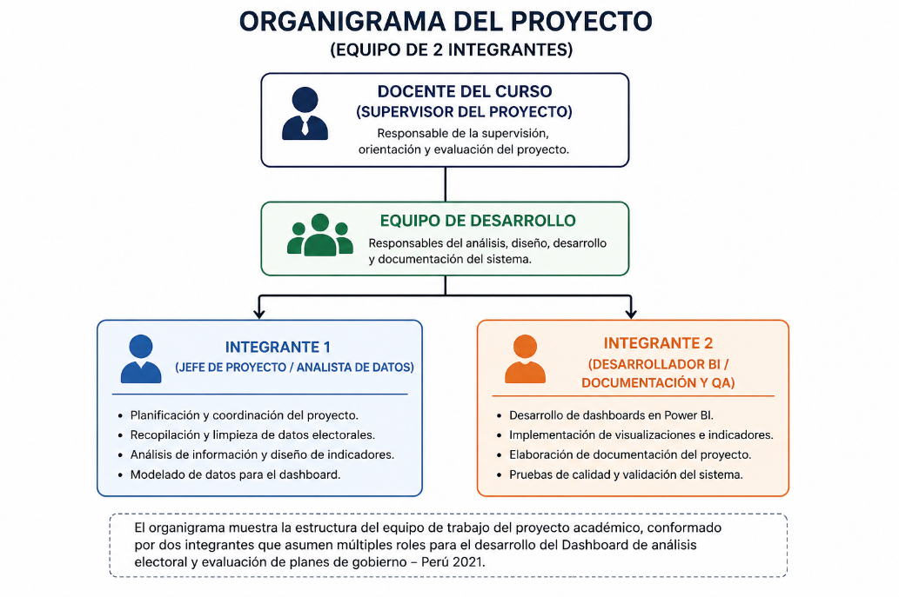

# VISIONAMIENTO DE LA EMPRESA

## Descripcion del problema

## En el Perú, la información electoral y los planes de gobierno de los candidatos presidenciales se encuentran dispersos en múltiples fuentes, como portales institucionales, documentos oficiales y medios digitales. Esta situación dificulta que los ciudadanos, estudiantes y analistas puedan acceder a información clara, organizada y comparable.

## En el contexto de las Elecciones Generales del Perú 2026, los datos sobre ingresos, patrimonio, antecedentes legales y actividad de campaña de los candidatos están disponibles de forma fragmentada en la ONPE y el JNE, lo que impide una evaluación comparativa directa entre candidatos.

## Esta falta de integración y visualización dificulta la toma de decisiones informadas, generando una necesidad de herramientas que permitan organizar, analizar y representar la información de manera clara y accesible.

## Por ello, se propone el desarrollo de un dashboard de análisis electoral que permita centralizar la información, facilitar la comparación de candidatos y mejorar la comprensión de los datos electorales.

## Objetivos de negocios

### Objetivo general

### Desarrollar un sistema de dashboard interactivo que permita analizar información electoral y analizar el perfil socioeconómico, legal y de campaña de los candidatos presidenciales, facilitando la visualización de datos, la comparación de candidatos y la toma de decisiones informadas.

### Objetivos específicos

### Centralizar la información de candidatos proveniente de fuentes oficiales (ONPE, JNE) en un solo sistema

### Facilitar la visualización del perfil socioeconómico de cada candidato mediante gráficos e indicadores

### Permitir la comparación de candidatos según ingresos, patrimonio y nivel de riesgo legal

### Clasificar a los candidatos según su nivel de riesgo legal y penal

### Proporcionar una herramienta accesible para estudiantes, ciudadanos y analistas.

## Objetivo de diseño

## Diseñar un dashboard interactivo utilizando herramientas de inteligencia de negocios (como Power BI), que permita representar la información electoral mediante visualizaciones dinámicas, facilitando la exploración de datos, el análisis comparativo y la interpretación de resultados de manera intuitiva.

## Alcance de proyecto

## El proyecto contempla el desarrollo de un dashboard interactivo basado en datos de las Elecciones Generales del Perú 2026.

## El sistema incluirá:

## Visualización del perfil de candidatos presidenciales

## Análisis de ingresos y patrimonio declarados ante la ONPE

## Clasificación de nivel de riesgo legal y penal

## Comparación entre candidatos mediante gráficos interactivos y filtros dinámicos.

## El sistema será implementado en un entorno web y estará orientado a fines académicos, por lo que no contempla integración en tiempo real con sistemas oficiales ni el manejo de datos sensibles.

## Viabilidad del sistema

## El desarrollo del sistema de Dashboard de análisis electoral y evaluación de planes de gobierno - Perú 2026 es viable desde diferentes perspectivas, las cuales han sido analizadas en el estudio de factibilidad.

### Viabilidad Técnica

### El sistema es técnicamente viable debido a que se basa en el uso de herramientas ampliamente utilizadas en el análisis y visualización de datos, como Power BI, Microsoft Excel y Python. Estas tecnologías permiten procesar grandes volúmenes de información y generar dashboards interactivos de manera eficiente.

### Asimismo, el proyecto no requiere infraestructura compleja, ya que puede ser implementado en computadoras personales y desplegado mediante servicios en la nube, utilizando herramientas como AWS o Azure. Esto reduce la complejidad técnica y facilita su desarrollo progresivo.

### Viabilidad Económica

### Desde el punto de vista económico, el proyecto es viable, ya que presenta resultados favorables según el análisis financiero realizado.

### Costo total del proyecto: S/ 8,275.70

### Relación Beneficio/Costo (B/C): 1.33

### Valor Actual Neto (VAN): S/ 2,242.94

### Tasa Interna de Retorno (TIR): 4.6%

### La relación B/C mayor a 1 indica que los beneficios superan los costos. Asimismo, el VAN positivo demuestra que el proyecto genera valor económico después de recuperar la inversión inicial.

### Aunque la TIR es menor a la tasa de descuento (8%), el proyecto se considera viable debido a su enfoque académico y a los beneficios indirectos que genera, como la optimización del tiempo de análisis y el acceso a información organizada.

### Viabilidad Operativa

### El sistema es operativamente viable, ya que los usuarios objetivo (estudiantes, analistas y ciudadanos) cuentan con conocimientos básicos en el uso de herramientas digitales, lo que facilita su adopción.

### El dashboard será diseñado con una interfaz intuitiva, permitiendo la interacción mediante gráficos, filtros y reportes dinámicos. Además, el sistema puede mantenerse y actualizarse fácilmente sin requerir recursos adicionales significativos, lo que garantiza su funcionamiento continuo.

### Viabilidad Legal

### El proyecto es legalmente viable, ya que se basa en el uso de información pública proveniente de fuentes oficiales, como datos electorales y planes de gobierno.

### Asimismo, cumple con la normativa vigente en el Perú, especialmente con la Ley N° 29733 – Ley de Protección de Datos Personales, que regula el uso adecuado de la información.

### El sistema no recopila ni almacena datos sensibles de los usuarios, ya que su finalidad es la visualización y análisis de datos públicos. Además, se respetan las licencias de las herramientas utilizadas, como Power BI, Python y otras tecnologías de uso académico.

### Viabilidad Social

### El sistema presenta una alta viabilidad social, ya que contribuye a mejorar el acceso a la información electoral, facilitando su comprensión mediante visualizaciones claras y organizadas.

### Esto permite a los usuarios tomar decisiones más informadas, promoviendo la transparencia y fortaleciendo la participación ciudadana. Asimismo, el proyecto tiene un impacto positivo en el ámbito educativo, al servir como herramienta de aprendizaje en análisis de datos.

### Viabilidad Ambiental

### El proyecto es ambientalmente viable, ya que se basa en el uso de herramientas digitales, reduciendo el consumo de papel y otros recursos físicos.

### Además, al utilizar infraestructura tecnológica existente y servicios en la nube, se minimiza el impacto ambiental, promoviendo el uso eficiente de los recursos y contribuyendo a prácticas sostenibles.

## Informacion obtenida del levantamiento de informacion

## Durante el levantamiento de información se identificaron las siguientes necesidades:

## Acceso a información electoral organizada y confiable

## Dificultad para comparar planes de gobierno

## Necesidad de visualizaciones claras y comprensibles

## Uso de herramientas interactivas para análisis de datos

## Acceso desde cualquier dispositivo con conexión a internet

## Asimismo, se identificó que los usuarios requieren una plataforma que integre resultados electorales con el análisis de propuestas, permitiendo una mejor comprensión del contexto político y social.

# ANALISIS DE PROCESOS

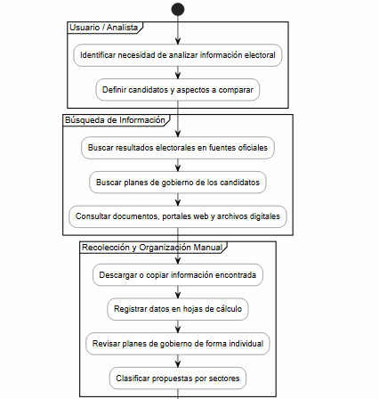

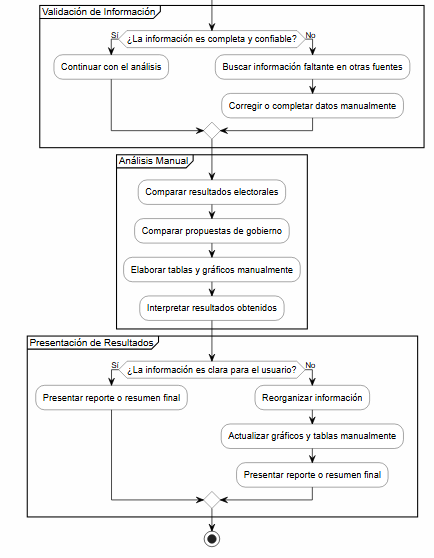

## Diagrama del proceso actual – diagrama de actividades

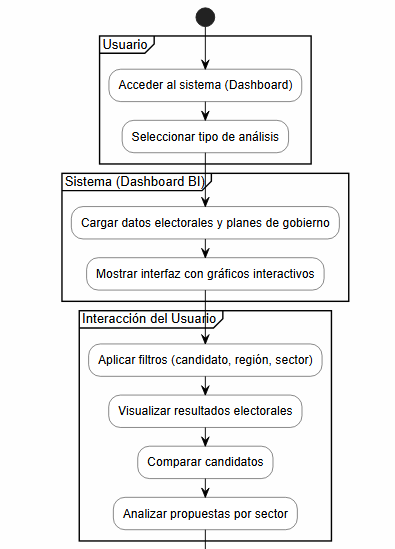

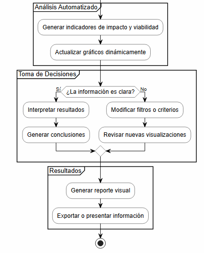

## Diagrama de proceso propuesto – diagrama de actividades inicial

## El proceso propuesto incorpora el uso de un dashboard interactivo que permite centralizar la información electoral y los planes de gobierno en un solo sistema. A través de herramientas de inteligencia de negocios, el usuario puede visualizar datos mediante gráficos dinámicos, aplicar filtros y comparar candidatos de manera rápida y eficiente. Esto reduce el tiempo de análisis, mejora la comprensión de la información y facilita la toma de decisiones informadas.

# ESPECIFICACION DE REQUERIMIENTOS DE SOFTWARE

## Cuadro de requerimientos funcional inicial

**Cuadro de requerimientos funcional inicial**

| Código | Requerimiento Funcional | Descripción | Prioridad |
| --- | --- | --- | --- |
| RF01 | Visualización de resultados electorales | El sistema debe mostrar los resultados de las Elecciones Generales Perú 2021 mediante gráficos interactivos | Alta |
| RF02 | Filtrado de información electoral | El sistema debe permitir filtrar los datos por candidato, región y tipo de información | Alta |
| RF03 | Consultar perfil socioeconómico del candidato | El sistema debe permitir visualizar los planes de gobierno de los candidatos presidenciales | Alta |
| RF04 | Clasificar candidatos por nivel de riesgo legal | El sistema debe organizar las propuestas por sectores (salud, educación, economía, seguridad, etc.) | Alta |
| RF05 | Comparación de candidatos | El sistema debe permitir comparar candidatos en base a resultados y propuestas | Alta |
| RF06 | Generación de indicadores | El sistema debe mostrar indicadores como porcentaje de votos y distribución electoral | Media |
| RF07 | Interacción con gráficos | El sistema debe permitir interacción con los gráficos mediante selección y filtros | Alta |
| RF08 | Exportación de información | El sistema debe permitir exportar reportes o visualizaciones | Baja |

## Cuadro de requerimiento no funcionales

**Cuadro de requerimientos no funcionales**

| Cuadro de requerimientos no funcionales | Cuadro de requerimientos no funcionales | Cuadro de requerimientos no funcionales | Cuadro de requerimientos no funcionales |
| --- | --- | --- | --- |
| Código | Requerimiento No Funcional | Descripción | Prioridad |
| RNF01 | Usabilidad | El sistema debe ser intuitivo y fácil de usar para usuarios sin conocimientos técnicos | Alta |
| RNF02 | Rendimiento | El sistema debe cargar la información en un tiempo menor a 5 segundos | Alta |
| RNF03 | Disponibilidad | El sistema debe estar disponible mediante navegador web | Alta |
| RNF04 | Compatibilidad | El sistema debe funcionar en navegadores modernos (Chrome, Edge, Firefox) | Media |
| RNF05 | Seguridad | El sistema no debe almacenar ni procesar datos personales sensibles | Alta |
| RNF06 | Escalabilidad | El sistema debe permitir la incorporación de nuevos datos electorales | Media |
| RNF07 | Mantenibilidad | El sistema debe permitir actualizaciones sin afectar su funcionamiento | Media |

## Cuadro de requerimientos funcionales final

| Código | Requerimiento Funcional | Descripción | Prioridad |
| --- | --- | --- | --- |
| RF01 | Visualización de resultados electorales interactivos | El sistema mostrará los resultados electorales mediante gráficos dinámicos (barras, tortas y mapas) | Alta |
| RF02 | Filtrado dinámico de datos | El usuario podrá aplicar filtros por candidato, región geográfica y sector de análisis | Alta |
| RF03 | Visualización estructurada de planes de gobierno | El sistema mostrará los planes de gobierno organizados por candidato | Alta |
| RF04 | Clasificación sectorial de propuestas | El sistema clasificará las propuestas en sectores como salud, educación, economía y seguridad | Alta |
| RF05 | Comparación de candidatos y propuestas | El sistema permitirá comparar candidatos en función de resultados electorales y propuestas de gobierno | Alta |
| RF06 | Generación automática de indicadores | El sistema calculará y mostrará indicadores como porcentajes de votos y distribución por región | Alta |
| RF07 | Interacción con dashboard | El usuario podrá interactuar con el dashboard mediante clics, filtros y segmentación de datos | Alta |
| RF08 | Evaluación de propuestas | El sistema permitirá analizar el impacto y viabilidad de propuestas mediante indicadores definidos | Media |
| RF09 | Generación de reportes visuales | El sistema permitirá generar reportes visuales para análisis | Media |

## Reglas de negocio

| Código | Regla de Negocio | Descripción |
| --- | --- | --- |
| RN01 | Uso de datos oficiales | El sistema utilizará únicamente datos provenientes de fuentes oficiales como ONPE y planes de gobierno |
| RN02 | Clasificación obligatoria | Todas las propuestas deben estar clasificadas en sectores definidos |
| RN03 | Representación de resultados | Los resultados electorales deben mostrarse en valores absolutos y porcentuales |
| RN04 | Integridad de datos | Los datos no podrán ser modificados por el usuario final |
| RN05 | Actualización dinámica | Los indicadores deben actualizarse automáticamente al aplicar filtros |
| RN06 | Acceso libre | El sistema no requerirá autenticación de usuarios |
| RN07 | Visualización obligatoria | Toda información debe representarse mediante gráficos o indicadores |
| RN08 | Consistencia de información | Los datos deben mantenerse coherentes en todas las visualizaciones del sistema |

# FASE DE DESARROLLO

## Perfiles de usuario

| Perfil | Descripción | Funciones principales |
| --- | --- | --- |
| Usuario general | Ciudadano, estudiante o persona interesada en analizar información electoral. | Visualizar resultados, aplicar filtros, comparar candidatos y consultar propuestas. |
| Analista de datos | Usuario encargado de revisar la información electoral y validar los indicadores. | Analizar resultados, evaluar propuestas, revisar indicadores y validar datos. |
| Administrador del dashboard | Encargado técnico del mantenimiento del sistema. | Actualizar datos, mantener visualizaciones y verificar el correcto funcionamiento del dashboard. |

## Modelo conceptual

### Diagrama de paquetes

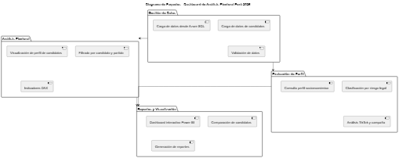

## El diagrama de paquetes organiza el sistema en cuatro módulos principales. El paquete de Gestión de Datos permite cargar y validar la información de los candidatos presidenciales proveniente de la base de datos Azure SQL, incluyendo datos personales, ingresos, patrimonio, antecedentes legales y actividad en redes sociales.

## Luego, el módulo de Análisis Electoral procesa dicha información para visualizar el perfil de cada candidato mediante filtros dinámicos por candidato y partido político, calculando indicadores clave mediante medidas DAX en Power BI.

## El módulo de Evaluación de Perfil complementa el análisis clasificando a los candidatos según su nivel de riesgo legal y penal, consultando su perfil socioeconómico declarado ante la ONPE y evaluando su presencia digital en TikTok y cobertura de visitas de campaña.

## Finalmente, el paquete de Reportes y Visualización presenta toda la información procesada mediante un dashboard interactivo desarrollado en Power BI, permitiendo la comparación entre candidatos a través de gráficos de dispersión y la generación de reportes visuales exportables.interactivos.

### Diagramas de casos de uso

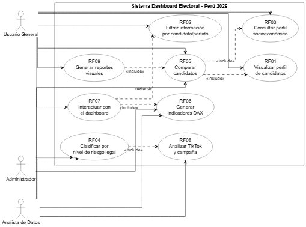

## El diagrama de casos de uso del sistema Dashboard de análisis electoral de candidatos presidenciales – Perú 2026 representa la interacción entre los actores y las funcionalidades principales del sistema. Se identifican tres actores: el Usuario General, el Analista de Datos y el Administrador.

## El Usuario General interactúa con el sistema para visualizar el perfil de los candidatos presidenciales, filtrar información por candidato o partido político, consultar el perfil socioeconómico de cada candidato, comparar candidatos mediante gráficos interactivos y generar reportes visuales, lo que le permite comprender de manera clara el panorama electoral.

## Por su parte, el Analista de Datos realiza funciones más especializadas, como la clasificación de candidatos según su nivel de riesgo legal y penal, la generación de indicadores DAX, el análisis de presencia en TikTok y cobertura de campaña, además de participar en procesos de consulta y comparación entre candidatos.

## El Administrador se encarga de la gestión de la información, incluyendo la clasificación por nivel de riesgo legal y el soporte en la generación de indicadores del dashboard.

## Asimismo, el diagrama muestra relaciones de tipo <<include>>, las cuales indican dependencias obligatorias entre casos de uso, como en el caso de la comparación de candidatos, que requiere visualizar el perfil de candidatos y consultar su perfil socioeconómico. También se presentan relaciones <<extend>>, que representan funcionalidades opcionales o complementarias, como la interacción con el dashboard al aplicar filtros dinámicos. En conjunto, el diagrama refleja de manera estructurada los requerimientos funcionales del sistema, evidenciando cómo cada actor participa en las diferentes operaciones que permiten el análisis y visualización del perfil integral de los candidatos presidenciales.

### Escenario de casos de usos (narrativa)

**RF-01 : Visualizar resultados electorales**

| Id Caso de Uso | RF-01 | RF-01 |  |
| --- | --- | --- | --- |
| Nombre | Visualizar resultados electorales | Visualizar resultados electorales |  |
| Tipo | Obligatorio ( X ) / Opcional ( ) | Obligatorio ( X ) / Opcional ( ) |  |
| Requisito ID (RF) | RF-01 | RF-01 |  |
| Versión | 1 | 1 |  |
| Autor | Equipo de Desarrollo | Equipo de Desarrollo |  |
| Actores | Usuario General, Analista de Datos | Usuario General, Analista de Datos |  |
| Interacción | Fase de Elaboración | Fase de Elaboración |  |
| Descripción | Permitir al usuario visualizar los resultados de las Elecciones Generales Perú 2021 mediante gráficos interactivos, indicadores y visualizaciones dinámicas dentro del dashboard. | Permitir al usuario visualizar los resultados de las Elecciones Generales Perú 2021 mediante gráficos interactivos, indicadores y visualizaciones dinámicas dentro del dashboard. |  |
| Referencias | Diagrama de casos de uso RF01 | Diagrama de casos de uso RF01 |  |
| Anexos | Ninguno | Ninguno |  |
| Precondiciones | 1. El sistema debe estar disponible. | 1. El sistema debe estar disponible. |  |
| Precondiciones | 2. Los datos electorales deben estar cargados en el dashboard. | 2. Los datos electorales deben estar cargados en el dashboard. |  |
| Precondiciones | 3. El usuario debe tener acceso al sistema. | 3. El usuario debe tener acceso al sistema. |  |
| PostCondiciones | 1.El usuario visualiza correctamente los resultados electorales. | 1.El usuario visualiza correctamente los resultados electorales. |  |
| PostCondiciones | 2. El sistema muestra gráficos e indicadores relacionados con los resultados de votación. | 2. El sistema muestra gráficos e indicadores relacionados con los resultados de votación. |  |
| PostCondiciones | 2. El sistema muestra gráficos e indicadores relacionados con los resultados de votación. | 2. El sistema muestra gráficos e indicadores relacionados con los resultados de votación. |  |
| Flujo Normal de eventos | Flujo Normal de eventos | Flujo Normal de eventos |  |
| Usuario | Usuario | Sistema |  |
| 1. Accede al dashboard electoral. | 1. Accede al dashboard electoral. | 2. Muestra la pantalla principal del sistema. |  |
| 3. Selecciona la sección de resultados electorales. | 3. Selecciona la sección de resultados electorales. | 4. Carga la información electoral disponible. |  |
| 5. Revisa los gráficos e indicadores mostrados. | 5. Revisa los gráficos e indicadores mostrados. | 6. Presenta los resultados electorales mediante gráficos interactivos. |  |
| 7. Analiza la información visualizada. | 7. Analiza la información visualizada. | 8. Mantiene disponible la información para nuevas consultas o filtros. |  |
| Flujo de excepción E001 | Flujo de excepción E001 | Flujo de excepción E001 |  |
| 1. Intenta visualizar los resultados electorales. | 1. Intenta visualizar los resultados electorales. | 2. Detecta que los datos no están disponibles o no han sido cargados correctamente. |  |
| 3. Espera respuesta del sistema. | 3. Espera respuesta del sistema. | 4. Muestra el mensaje: “No se encontraron datos electorales disponibles”. |  |
| Anexos | Anexos | Anexos |  |

**RF-02 : Filtrar información electoral**

| Id Caso de Uso | RF-02 | RF-02 |  |
| --- | --- | --- | --- |
| Nombre | Filtrar información electoral | Filtrar información electoral |  |
| Tipo | Obligatorio ( x ) / Opcional ( ) | Obligatorio ( x ) / Opcional ( ) |  |
| Requisito ID (RF) | RF-02 | RF-02 |  |
| Versión | 1 | 1 |  |
| Autor | Equipo de Desarrollo | Equipo de Desarrollo |  |
| Actores | Usuario General, Analista de Datos | Usuario General, Analista de Datos |  |
| Interacción | Aplicación de filtros en el dashboard | Aplicación de filtros en el dashboard |  |
| Descripción | Permitir al usuario filtrar la información electoral según criterios como candidato, región o sector, actualizando dinámicamente los gráficos del dashboard. | Permitir al usuario filtrar la información electoral según criterios como candidato, región o sector, actualizando dinámicamente los gráficos del dashboard. |  |
| Referencias | Diagrama de casos de uso RF02 | Diagrama de casos de uso RF02 |  |
| Anexos | Ninguno | Ninguno |  |
| Precondiciones | 1. El dashboard debe estar cargado. | 1. El dashboard debe estar cargado. |  |
| Precondiciones | 2. Los datos electorales deben estar disponibles. | 2. Los datos electorales deben estar disponibles. |  |
| PostCondiciones | 1. Los gráficos muestran información filtrada. | 1. Los gráficos muestran información filtrada. |  |
| PostCondiciones | 1. Los gráficos muestran información filtrada. | 1. Los gráficos muestran información filtrada. |  |
| Flujo Normal de eventos | Flujo Normal de eventos | Flujo Normal de eventos |  |
| Usuario | Usuario | Sistema |  |
| 1. Selecciona filtros (candidato, región, etc.). | 1. Selecciona filtros (candidato, región, etc.). | 2. Procesa la selección. |  |
| 3. Espera actualización. | 3. Espera actualización. | 4. Actualiza gráficos dinámicamente. |  |
| 5. Visualiza resultados filtrados. | 5. Visualiza resultados filtrados. |  |  |
| Flujo de excepción E001 | Flujo de excepción E001 | Flujo de excepción E001 |  |
| 1. Aplica filtros sin datos. | 1. Aplica filtros sin datos. | 2. Muestra “No hay resultados disponibles”. |  |
| Anexos | Anexos | Anexos |  |
| RF-03: Consultar planes de gobierno | RF-03: Consultar planes de gobierno | RF-03: Consultar planes de gobierno |  |
| Id Caso de Uso | RF-03 | RF-03 |  |
| Nombre | Consultar planes de gobierno | Consultar planes de gobierno |  |
| Tipo | Obligatorio ( x ) / Opcional ( ) | Obligatorio ( x ) / Opcional ( ) |  |
| Requisito ID (RF) | RF-03 | RF-03 |  |
| Versión | 1 | 1 |  |
| Autor | Equipo de Desarrollo | Equipo de Desarrollo |  |
| Actores | Usuario General, Analista | Usuario General, Analista |  |
| Interacción | Consulta de propuestas | Consulta de propuestas |  |
| Descripción | Permitir visualizar las propuestas de los candidatos organizadas por sectores. | Permitir visualizar las propuestas de los candidatos organizadas por sectores. |  |
| Referencias | Diagrama de casos de uso RF03 | Diagrama de casos de uso RF03 |  |
| Anexos | Ninguno | Ninguno |  |
| Precondiciones | 1. Los planes deben estar cargados. | 1. Los planes deben estar cargados. |  |
| Precondiciones | 1. Los planes deben estar cargados. | 1. Los planes deben estar cargados. |  |
| PostCondiciones | 1. El usuario visualiza propuestas correctamente. | 1. El usuario visualiza propuestas correctamente. |  |
| PostCondiciones | 1. El usuario visualiza propuestas correctamente. | 1. El usuario visualiza propuestas correctamente. |  |
| Flujo Normal de eventos | Flujo Normal de eventos | Flujo Normal de eventos |  |
| Usuario | Usuario | Sistema |  |
| 1. Selecciona candidato. | 1. Selecciona candidato. | 2. Busca información. |  |
| Usuario Sistema 1. Selecciona candidato. 2. Busca información. 3. Espera respuesta. | Usuario Sistema 1. Selecciona candidato. 2. Busca información. 3. Espera respuesta. | 4. Muestra propuestas organizadas. |  |
| 5. Analiza información. | 5. Analiza información. |  |  |
| Flujo de excepción E001 | Flujo de excepción E001 | Flujo de excepción E001 |  |
| 1. Selecciona candidato sin datos. | 1. Selecciona candidato sin datos. | 2. Muestra mensaje informativo. |  |
| Anexos | Anexos | Anexos |  |
| RF-04: Clasificar propuestas | RF-04: Clasificar propuestas | RF-04: Clasificar propuestas |  |
| Id Caso de Uso | RF-04 | RF-04 |  |
| Nombre | Clasificar propuestas por sector | Clasificar propuestas por sector |  |
| Tipo | Obligatorio ( x ) / Opcional ( ) | Obligatorio ( x ) / Opcional ( ) |  |
| Requisito ID (RF) | RF-04 | RF-04 |  |
| Versión | 1 | 1 |  |
| Autor | Equipo de Desarrollo | Equipo de Desarrollo |  |
| Actores | Analista de Datos, Administrador | Analista de Datos, Administrador |  |
| Interacción | Gestión y organización de propuestas de gobierno | Gestión y organización de propuestas de gobierno |  |
| Descripción | Permitir clasificar las propuestas de los candidatos presidenciales en sectores definidos como educación, salud, economía, seguridad e infraestructura, con el fin de facilitar su análisis y comparación dentro del dashboard. | Permitir clasificar las propuestas de los candidatos presidenciales en sectores definidos como educación, salud, economía, seguridad e infraestructura, con el fin de facilitar su análisis y comparación dentro del dashboard. |  |
| Referencias | Diagrama de casos de uso RF04 | Diagrama de casos de uso RF04 |  |
| Anexos | Ninguno | Ninguno |  |
| Precondiciones | 1. Las propuestas de gobierno deben estar cargadas en el sistema. Los sectores de clasificación deben estar definidos. El Analista de Datos o Administrador debe tener acceso al módulo correspondiente. | 1. Las propuestas de gobierno deben estar cargadas en el sistema. Los sectores de clasificación deben estar definidos. El Analista de Datos o Administrador debe tener acceso al módulo correspondiente. |  |
| Precondiciones | 2. Los sectores de clasificación deben estar definidos. | 2. Los sectores de clasificación deben estar definidos. |  |
| Precondiciones | 3. El Analista de Datos o Administrador debe tener acceso al módulo correspondiente. | 3. El Analista de Datos o Administrador debe tener acceso al módulo correspondiente. |  |
| PostCondiciones | 1. Las propuestas quedan clasificadas por sector. | 1. Las propuestas quedan clasificadas por sector. |  |
| PostCondiciones | 2. La información queda disponible para la comparación y evaluación de propuestas. | 2. La información queda disponible para la comparación y evaluación de propuestas. |  |
| Flujo Normal de eventos | Flujo Normal de eventos | Flujo Normal de eventos |  |
| Usuario | Usuario | Sistema |  |
| 1. . Accede al módulo de propuestas. | 1. . Accede al módulo de propuestas. | 2. Muestra la lista de propuestas registradas. |  |
| 3. Selecciona una propuesta. | 3. Selecciona una propuesta. | 4.Muestra los sectores disponibles. |  |
| 5.Asigna la propuesta a un sector. | 5.Asigna la propuesta a un sector. | 6. Registra la clasificación seleccionada. |  |
| 7. Confirma la clasificación. | 7. Confirma la clasificación. | 8. Actualiza la información en el dashboard. |  |
| Flujo de excepción E001 | Flujo de excepción E001 | Flujo de excepción E001 |  |
| 1. Selecciona una propuesta incompleta. | 1. Selecciona una propuesta incompleta. | 2. Muestra el mensaje: “La propuesta no contiene información suficiente para ser clasificada”. |  |
| Anexos | Anexos | Anexos |  |
| RF-05: Comparar candidatos y propuestas | RF-05: Comparar candidatos y propuestas | RF-05: Comparar candidatos y propuestas |  |
| Id Caso de Uso | RF-05 | RF-05 |  |
| Nombre | Comparar candidatos y propuestas | Comparar candidatos y propuestas |  |
| Tipo | Obligatorio ( x ) / Opcional ( ) | Obligatorio ( x ) / Opcional ( ) |  |
| Requisito ID (RF) | RF-05 | RF-05 |  |
| Versión | 1 | 1 |  |
| Autor | Equipo de Desarrollo | Equipo de Desarrollo |  |
| Actores | Usuario General, Analista de Datos | Usuario General, Analista de Datos |  |
| Interacción | Comparación visual de candidatos, resultados electorales y propuestas | Comparación visual de candidatos, resultados electorales y propuestas |  |
| Descripción | Permitir comparar candidatos presidenciales considerando resultados electorales, porcentaje de votos y propuestas de gobierno clasificadas por sectores. | Permitir comparar candidatos presidenciales considerando resultados electorales, porcentaje de votos y propuestas de gobierno clasificadas por sectores. |  |
| Referencias | Diagrama de casos de uso RF05 | Diagrama de casos de uso RF05 |  |
| Anexos | Ninguno | Ninguno |  |
| Precondiciones | 1. Los datos electorales deben estar cargados. | 1. Los datos electorales deben estar cargados. |  |
| Precondiciones | 2. Los planes de gobierno deben estar registrados. | 2. Los planes de gobierno deben estar registrados. |  |
| Precondiciones | 3. Deben existir al menos dos candidatos disponibles para comparar. | 3. Deben existir al menos dos candidatos disponibles para comparar. |  |
| PostCondiciones | 1. El usuario visualiza una comparación entre candidatos. | 1. El usuario visualiza una comparación entre candidatos. |  |
| PostCondiciones | 2. El sistema muestra diferencias en resultados electorales y propuestas de gobierno. | 2. El sistema muestra diferencias en resultados electorales y propuestas de gobierno. |  |
| Flujo Normal de eventos | Flujo Normal de eventos | Flujo Normal de eventos |  |
| Usuario | Usuario | Sistema |  |
| 1. Accede a la sección de comparación. | 1. Accede a la sección de comparación. | 2. Muestra la lista de candidatos disponibles. |  |
| 3. Selecciona dos o más candidatos. | 3. Selecciona dos o más candidatos. | 4. Recupera los datos electorales y propuestas de los candidatos seleccionados. |  |
| 5. Solicita la comparación. | 5. Solicita la comparación. | 6. Genera gráficos y tablas comparativas. |  |
| 7. Revisa la comparación presentada. | 7. Revisa la comparación presentada. | 8. Mantiene la información disponible para aplicar filtros o generar reportes. |  |
| Flujo de excepción E001 | Flujo de excepción E001 | Flujo de excepción E001 |  |
| 1. Selecciona un solo candidato. | 1. Selecciona un solo candidato. | 2. Muestra el mensaje: “Debe seleccionar al menos dos candidatos para realizar la comparación”. |  |
| Anexos | Anexos | Anexos |  |
| RF-06: Generar indicadores dinámicos | RF-06: Generar indicadores dinámicos | RF-06: Generar indicadores dinámicos |  |
| Id Caso de Uso | RF-06 | RF-06 |  |
| Nombre | Generar indicadores dinámicos | Generar indicadores dinámicos |  |
| Tipo | Obligatorio ( x ) / Opcional ( ) | Obligatorio ( x ) / Opcional ( ) |  |
| Requisito ID (RF) | RF-06 | RF-06 |  |
| Versión | 1 | 1 |  |
| Autor | Equipo de Desarrollo | Equipo de Desarrollo |  |
| Actores | Analista de Datos, Administrador | Analista de Datos, Administrador |  |
| Interacción | Procesamiento de datos y generación de métricas electorales | Procesamiento de datos y generación de métricas electorales |  |
| Descripción | Permitir generar indicadores dinámicos a partir de los datos electorales, tales como porcentaje de votos, distribución por región, cantidad de propuestas por sector e indicadores de análisis comparativo. | Permitir generar indicadores dinámicos a partir de los datos electorales, tales como porcentaje de votos, distribución por región, cantidad de propuestas por sector e indicadores de análisis comparativo. |  |
| Referencias | Diagrama de casos de uso RF06 | Diagrama de casos de uso RF06 |  |
| Anexos | Ninguno | Ninguno |  |
| Precondiciones | 1. Los datos electorales deben estar cargados y validados. | 1. Los datos electorales deben estar cargados y validados. |  |
| Precondiciones | 2. Las propuestas deben estar clasificadas correctamente. | 2. Las propuestas deben estar clasificadas correctamente. |  |
| Precondiciones | 3. El sistema debe contar con reglas de cálculo definidas. | 3. El sistema debe contar con reglas de cálculo definidas. |  |
| PostCondiciones | 1. Los indicadores son generados correctamente. | 1. Los indicadores son generados correctamente. |  |
| PostCondiciones | 2. Los indicadores se muestran en el dashboard de forma dinámica. | 2. Los indicadores se muestran en el dashboard de forma dinámica. |  |
| Flujo Normal de eventos | Flujo Normal de eventos | Flujo Normal de eventos |  |
| Usuario | Usuario | Sistema |  |
| 1. Accede al módulo de indicadores. | 1. Accede al módulo de indicadores. | 2. Carga los datos electorales y propuestas disponibles. |  |
| 3. Solicita la generación de indicadores. | 3. Solicita la generación de indicadores. | 4. Procesa los datos según las reglas definidas. |  |
| 5. Espera el resultado del procesamiento. | 5. Espera el resultado del procesamiento. | 6. Calcula porcentajes, distribuciones y métricas. |  |
| 7. Revisa los indicadores generados. | 7. Revisa los indicadores generados. | 8. Muestra los indicadores en tarjetas, gráficos o tablas. |  |
| Flujo de excepción E001 | Flujo de excepción E001 | Flujo de excepción E001 |  |
| 1. Solicita generar indicadores con datos incompletos. | 1. Solicita generar indicadores con datos incompletos. | 2. Muestra el mensaje: “No es posible generar indicadores porque existen datos incompletos o no validados”. |  |
| Anexos | Anexos | Anexos |  |
| RF-07: Interactuar con el dashboard | RF-07: Interactuar con el dashboard | RF-07: Interactuar con el dashboard |  |
| Id Caso de Uso | RF-07 | RF-07 |  |
| Nombre | Interactuar con el dashboard | Interactuar con el dashboard |  |
| Tipo | Obligatorio ( x ) / Opcional ( ) | Obligatorio ( x ) / Opcional ( ) |  |
| Requisito ID (RF) | RF-07 | RF-07 |  |
| Versión | 1 | 1 |  |
| Autor | Equipo de Desarrollo | Equipo de Desarrollo |  |
| Actores | Usuario General, Analista de Datos | Usuario General, Analista de Datos |  |
| Interacción | Navegación e interacción con visualizaciones, filtros y gráficos | Navegación e interacción con visualizaciones, filtros y gráficos |  |
| Descripción | Permitir al usuario interactuar con los elementos del dashboard mediante clics, filtros, segmentadores y selección de gráficos, actualizando la información mostrada de forma dinámica. indicadores de análisis comparativo. | Permitir al usuario interactuar con los elementos del dashboard mediante clics, filtros, segmentadores y selección de gráficos, actualizando la información mostrada de forma dinámica. indicadores de análisis comparativo. |  |
| Referencias | Diagrama de casos de uso RF07 | Diagrama de casos de uso RF07 |  |
| Anexos | Ninguno | Ninguno |  |
| Precondiciones | 1. El dashboard debe estar disponible. | 1. El dashboard debe estar disponible. |  |
| Precondiciones | 2. Las visualizaciones deben estar cargadas correctamente. | 2. Las visualizaciones deben estar cargadas correctamente. |  |
| Precondiciones | 3.El usuario debe acceder al sistema desde un navegador compatible. | 3.El usuario debe acceder al sistema desde un navegador compatible. |  |
| PostCondiciones | 1. El sistema actualiza la información según la interacción del usuario. | 1. El sistema actualiza la información según la interacción del usuario. |  |
| PostCondiciones | 2. El usuario puede explorar los datos de forma dinámica. | 2. El usuario puede explorar los datos de forma dinámica. |  |
| Flujo Normal de eventos | Flujo Normal de eventos | Flujo Normal de eventos |  |
| Usuario | Usuario | Sistema |  |
| 1. Ingresa al dashboard. | 1. Ingresa al dashboard. | 2. Muestra las visualizaciones disponibles. |  |
| 3. Hace clic en gráficos, filtros o segmentadores. | 3. Hace clic en gráficos, filtros o segmentadores. | 4. Detecta la interacción realizada. |  |
| 5. Selecciona una vista o elemento de análisis. | 5. Selecciona una vista o elemento de análisis. | 6. Actualiza los gráficos relacionados. |  |
| 7. Explora la información actualizada. | 7. Explora la información actualizada. | 8. Mantiene la navegación activa para nuevas consultas. |  |
| Flujo de excepción E001 | Flujo de excepción E001 | Flujo de excepción E001 |  |
| 1. Intenta interactuar con una visualización que no carga. | 1. Intenta interactuar con una visualización que no carga. | 2. Muestra el mensaje: “No se pudo actualizar la visualización seleccionada”. |  |
| Anexos | Anexos | Anexos |  |
| RF-08: Evaluar impacto y viabilidad de propuestas | RF-08: Evaluar impacto y viabilidad de propuestas | RF-08: Evaluar impacto y viabilidad de propuestas |  |
| Id Caso de Uso | RF-08 | RF-08 |  |
| Nombre | Evaluar impacto y viabilidad de propuestas | Evaluar impacto y viabilidad de propuestas |  |
| Tipo | Obligatorio ( x ) / Opcional ( ) | Obligatorio ( x ) / Opcional ( ) |  |
| Requisito ID (RF) | RF-08 | RF-08 |  |
| Versión | 1 | 1 |  |
| Autor | Equipo de Desarrollo | Equipo de Desarrollo |  |
| Actores | Analista de Datos | Analista de Datos |  |
| Interacción | Análisis de propuestas mediante criterios de impacto, costo estimado y viabilidad | Análisis de propuestas mediante criterios de impacto, costo estimado y viabilidad |  |
| Descripción | Permitir evaluar las propuestas de gobierno mediante indicadores definidos, considerando criterios como impacto social, costo estimado, sector asociado y nivel de viabilidad. indicadores de análisis comparativo. | Permitir evaluar las propuestas de gobierno mediante indicadores definidos, considerando criterios como impacto social, costo estimado, sector asociado y nivel de viabilidad. indicadores de análisis comparativo. |  |
| Referencias | Diagrama de casos de uso RF08 | Diagrama de casos de uso RF08 |  |
| Anexos | Ninguno | Ninguno |  |
| Precondiciones | 1. Las propuestas deben estar registradas en el sistema. | 1. Las propuestas deben estar registradas en el sistema. |  |
| Precondiciones | 2. Las propuestas deben estar clasificadas por sector. | 2. Las propuestas deben estar clasificadas por sector. |  |
| Precondiciones | 3. Deben existir criterios de evaluación definidos. | 3. Deben existir criterios de evaluación definidos. |  |
| PostCondiciones | 1. La propuesta queda evaluada mediante indicadores. | 1. La propuesta queda evaluada mediante indicadores. |  |
| PostCondiciones | 2. El sistema muestra el resultado de la evaluación en el dashboard. | 2. El sistema muestra el resultado de la evaluación en el dashboard. |  |
| Flujo Normal de eventos | Flujo Normal de eventos | Flujo Normal de eventos |  |
| Usuario | Usuario | Sistema |  |
| 1. Accede al módulo de evaluación de propuestas. | 1. Accede al módulo de evaluación de propuestas. | 2. Muestra las propuestas clasificadas por sector. |  |
| 3. Selecciona una propuesta. | 3. Selecciona una propuesta. | 4. Muestra los criterios de evaluación disponibles. |  |
| 5. Revisa impacto, costo estimado y viabilidad. | 5. Revisa impacto, costo estimado y viabilidad. | 6. Procesa la evaluación según los criterios establecidos. |  |
| 7. Consulta el resultado de la evaluación. | 7. Consulta el resultado de la evaluación. | 8. Muestra el nivel de impacto y viabilidad de la propuesta. |  |
| Flujo de excepción E001 | Flujo de excepción E001 | Flujo de excepción E001 |  |
| 1. Selecciona una propuesta sin datos suficientes. | 1. Selecciona una propuesta sin datos suficientes. | 2. Muestra el mensaje: “La propuesta no cuenta con información suficiente para evaluar su impacto y viabilidad”. |  |
| Anexos | Anexos | Anexos |  |
| RF-09: Generar reportes visuales | RF-09: Generar reportes visuales | RF-09: Generar reportes visuales |  |
| Id Caso de Uso | RF-09 | RF-09 |  |
| Nombre | Generar reportes visuales | Generar reportes visuales |  |
| Tipo | Obligatorio ( x ) / Opcional ( ) | Obligatorio ( x ) / Opcional ( ) |  |
| Requisito ID (RF) | RF-09 | RF-09 |  |
| Versión | 1 | 1 |  |
| Autor | Equipo de Desarrollo | Equipo de Desarrollo |  |
| Actores | Usuario General, Analista de Datos | Usuario General, Analista de Datos |  |
| Interacción | Generación y exportación de reportes visuales del análisis electoral | Generación y exportación de reportes visuales del análisis electoral |  |
| Descripción | Permitir generar reportes visuales a partir de la información mostrada en el dashboard, incluyendo resultados electorales, comparación de candidatos, indicadores y análisis de propuestas. | Permitir generar reportes visuales a partir de la información mostrada en el dashboard, incluyendo resultados electorales, comparación de candidatos, indicadores y análisis de propuestas. |  |
| Referencias | Diagrama de casos de uso RF09 | Diagrama de casos de uso RF09 |  |
| Anexos | Ninguno | Ninguno |  |
| Precondiciones | 1. El dashboard debe mostrar información válida. | 1. El dashboard debe mostrar información válida. |  |
| Precondiciones | 2. Deben existir gráficos o indicadores disponibles para reportar. | 2. Deben existir gráficos o indicadores disponibles para reportar. |  |
| Precondiciones | 3. El usuario debe haber seleccionado la información que desea presentar. | 3. El usuario debe haber seleccionado la información que desea presentar. |  |
| PostCondiciones | 1. El reporte visual es generado correctamente. | 1. El reporte visual es generado correctamente. |  |
| PostCondiciones | 2.El usuario puede visualizar o exportar el reporte. | 2.El usuario puede visualizar o exportar el reporte. |  |
| Flujo Normal de eventos | Flujo Normal de eventos | Flujo Normal de eventos |  |
| Usuario | Usuario | Sistema |  |
| 1. Selecciona la opción de generar reporte. | 1. Selecciona la opción de generar reporte. | 2. Recupera la información mostrada en el dashboard. |  |
| 3. Define el contenido que desea incluir. | 3. Define el contenido que desea incluir. | 4. Organiza gráficos, indicadores y tablas seleccionadas. |  |
| 5. Confirma la generación del reporte. | 5. Confirma la generación del reporte. | 6. Genera el reporte visual. |  |
| 7. Visualiza o exporta el reporte. | 7. Visualiza o exporta el reporte. | 8. Muestra el reporte generado correctamente. |  |
| Flujo de excepción E001 | Flujo de excepción E001 | Flujo de excepción E001 |  |
| 1. Intenta generar un reporte sin información seleccionada. | 1. Intenta generar un reporte sin información seleccionada. | 2. Muestra el mensaje: “Debe seleccionar información válida para generar el reporte”. |  |
| Anexos | Anexos | Anexos |  |

## Modelo logico

### Analisis de objetos

## El análisis de objetos permite identificar las entidades principales que intervienen en el sistema Dashboard de análisis electoral y evaluación de planes de gobierno – Perú 2021. Estos objetos representan la información que será gestionada, visualizada y analizada dentro del dashboard.

| Objeto | Descripción | Atributos principales |
| --- | --- | --- |
| Usuario | Representa a la persona que interactúa con el dashboard para consultar información electoral, aplicar filtros, comparar candidatos y generar reportes. | idUsuario, tipoUsuario, nombre |
| Candidato | Representa a cada candidato presidencial incluido en el análisis electoral del Perú 2021. | idCandidato, nombre, partidoPolitico |
| ResultadoElectoral | Contiene la información de votos obtenidos por cada candidato, incluyendo valores absolutos y porcentuales. | idResultado, votosObtenidos, porcentajeVotos |
| Region | Representa la ubicación geográfica asociada a los resultados electorales. | idRegion, nombreRegion, departamento |
| PlanGobierno | Representa el documento o conjunto de propuestas presentadas por un candidato presidencial. | idPlan, nombrePlan, periodo |
| Propuesta | Representa una propuesta específica incluida dentro de un plan de gobierno. | idPropuesta, descripcion, costoEstimado, impactoEstimado, viabilidad |
| Sector | Representa la categoría a la que pertenece una propuesta, como salud, educación, economía, seguridad o infraestructura. | idSector, nombreSector |
| Indicador | Representa una métrica calculada a partir de los datos electorales o de las propuestas. | idIndicador, nombreIndicador, valor, tipoIndicador |
| Filtro | Representa los criterios utilizados por el usuario para segmentar la información visualizada. | idFiltro, criterio, valorSeleccionado |
| Dashboard | Representa la interfaz principal donde se muestran gráficos, indicadores y reportes visuales. | idDashboard, nombreDashboard, fechaActualizacion |
| ReporteVisual | Representa el resultado generado a partir de la información mostrada en el dashboard. | idReporte, titulo, fechaGeneracion, formato |
| FuenteDatos | Representa el origen de la información utilizada por el sistema, como datos oficiales electorales o planes de gobierno. | idFuente, nombreFuente, tipoFuente, urlFuente |

## El sistema se estructura a partir de la relación entre candidatos, resultados electorales y planes de gobierno. Cada Candidato puede tener uno o más ResultadosElectorales, asociados a una determinada Región. Asimismo, cada candidato cuenta con un PlanGobierno, el cual contiene diversas Propuestas clasificadas por Sector.

## El Usuario interactúa con el Dashboard para visualizar resultados, aplicar Filtros, consultar propuestas y generar ReportesVisuales. A su vez, el dashboard utiliza Indicadores calculados a partir de los resultados electorales y de la evaluación de propuestas. Finalmente, la información del sistema proviene de distintas FuentesDatos, las cuales permiten alimentar el análisis electoral.

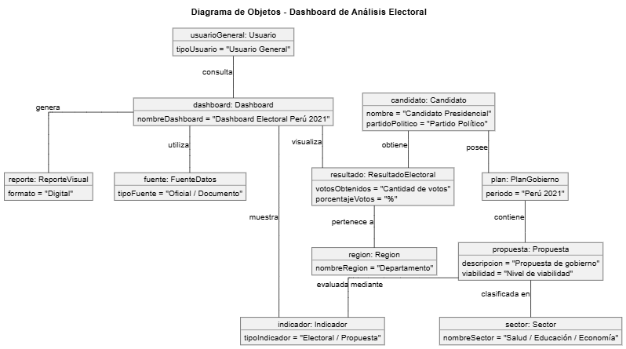

### Diagrama de actividades con objetos

## El diagrama de actividades con objetos representa el flujo de interacción entre el usuario y los principales objetos del sistema Dashboard de análisis electoral. El proceso inicia cuando el usuario accede al dashboard y selecciona el tipo de análisis que desea realizar. Si elige el análisis electoral, el sistema carga los resultados electorales, obtiene los votos y porcentajes asociados a cada candidato y los relaciona con la región correspondiente. Si el usuario selecciona el análisis de planes de gobierno, el sistema carga las propuestas, las clasifica por sector y las muestra organizadas dentro del dashboard.

## Posteriormente, el usuario puede aplicar filtros para segmentar la información. El objeto Filtro define los criterios seleccionados y el dashboard actualiza las visualizaciones de manera dinámica. Luego, el objeto Indicador calcula las métricas correspondientes y el sistema las muestra mediante gráficos y tarjetas informativas. Finalmente, el usuario puede solicitar un reporte visual, el cual es generado por el objeto ReporteVisual y presentado o exportado desde el dashboard.

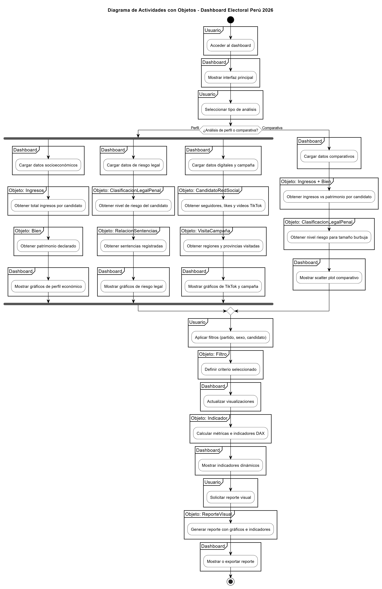

### Diagrama de secuencia

## El diagrama de secuencia muestra la comunicación entre el Usuario y los principales componentes del sistema durante la consulta y análisis de información electoral. El proceso inicia cuando el usuario accede al dashboard y selecciona el tipo de análisis que desea realizar. Dependiendo de la opción elegida, el sistema consulta los resultados electorales o los planes de gobierno, procesa la información y genera indicadores correspondientes. Posteriormente, el usuario puede aplicar filtros, lo que permite actualizar los datos, gráficos e indicadores de manera dinámica. Finalmente, el usuario puede solicitar un reporte visual, el cual es generado por el sistema y presentado para su visualización o exportación.

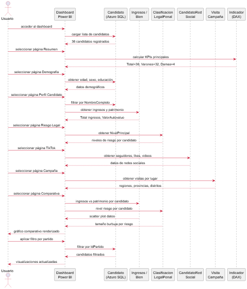

### Diagrama de clases

## El diagrama de clases representa la estructura lógica del sistema Dashboard de análisis electoral y evaluación de planes de gobierno. La clase Usuario interactúa con el Dashboard, desde donde puede aplicar filtros, visualizar indicadores y generar reportes visuales. La clase Candidato se relaciona con los ResultadosElectorales y con su respectivo PlanGobierno, el cual contiene diversas Propuestas clasificadas por Sector. Asimismo, los resultados electorales se asocian a una Región, permitiendo analizar la distribución de votos por ubicación geográfica. La clase Indicador permite representar métricas electorales y de evaluación de propuestas, mientras que FuenteDatos representa los orígenes de información utilizados por el sistema. Finalmente, ReporteVisual permite generar salidas visuales a partir de la información analizada en el dashboard.

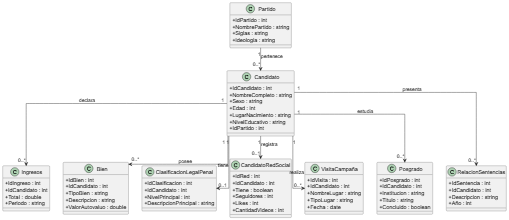

# CONCLUSIONES

# El desarrollo del sistema Dashboard de análisis electoral Perú 2026 permite centralizar información electoral y política en una plataforma visual e interactiva, facilitando el análisis de resultados, la comparación de candidatos y la evaluación de propuestas de gobierno.

# El sistema propuesto responde a la problemática identificada, ya que reduce la dispersión de información y mejora la comprensión de los datos mediante gráficos, filtros e indicadores dinámicos. Asimismo, permite que estudiantes, ciudadanos y analistas puedan acceder a información organizada para realizar análisis más claros y fundamentados.

# A través de la especificación de requerimientos, casos de uso, análisis de objetos y diagramas UML, se logró definir la estructura funcional y lógica del sistema, proporcionando una base sólida para su posterior implementación en herramientas de inteligencia de negocios como Power BI.

# Finalmente, el proyecto demuestra viabilidad técnica, operativa, económica, legal, social y ambiental, debido al uso de herramientas accesibles, datos públicos y una propuesta orientada al fortalecimiento de la transparencia informativa y la toma de decisiones informadas.

# RECOMENDACIONES

# Se recomienda continuar con la implementación del dashboard priorizando las funcionalidades principales, como la visualización de resultados electorales, la comparación de candidatos y la consulta de planes de gobierno.

# También se recomienda validar la información utilizada con fuentes oficiales, como datos electorales publicados por organismos competentes y documentos oficiales de planes de gobierno, con el fin de garantizar la confiabilidad del análisis.

# Asimismo, se sugiere realizar pruebas con usuarios finales para evaluar la facilidad de uso del dashboard, la claridad de las visualizaciones y la utilidad de los filtros e indicadores implementados.

# Finalmente, se recomienda considerar futuras mejoras, como la incorporación de nuevos procesos electorales, mayor detalle por región, nuevos indicadores de análisis y opciones adicionales de exportación de reportes visuales.

# BIBLIOGRAFIA

# WEBGRAFIA
