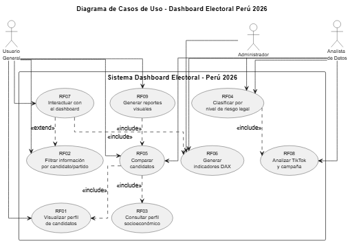
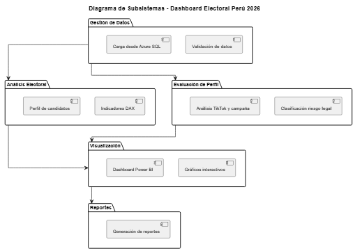
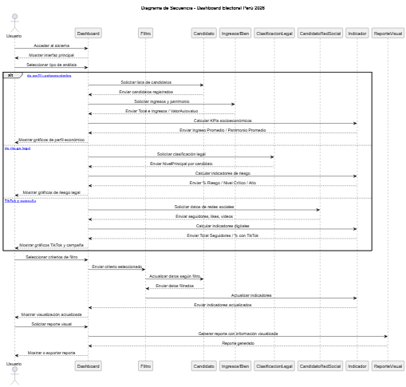
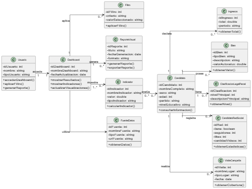
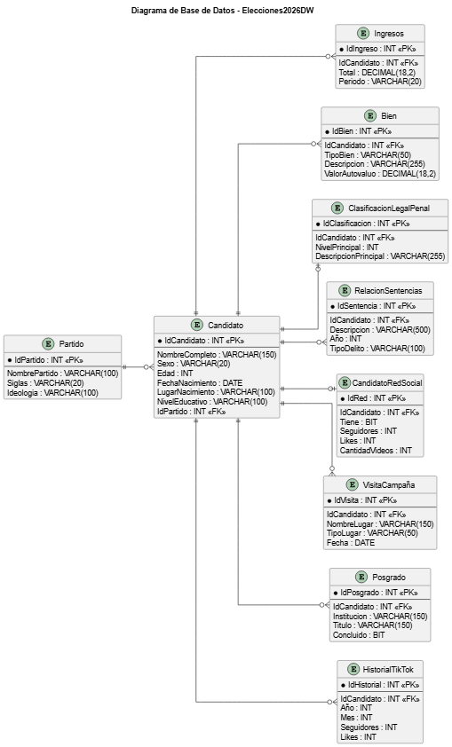
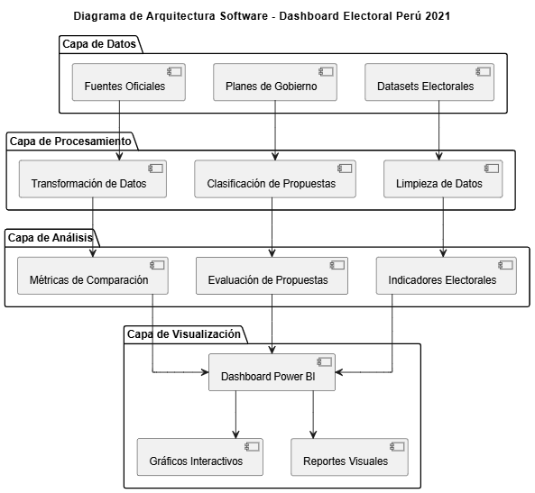
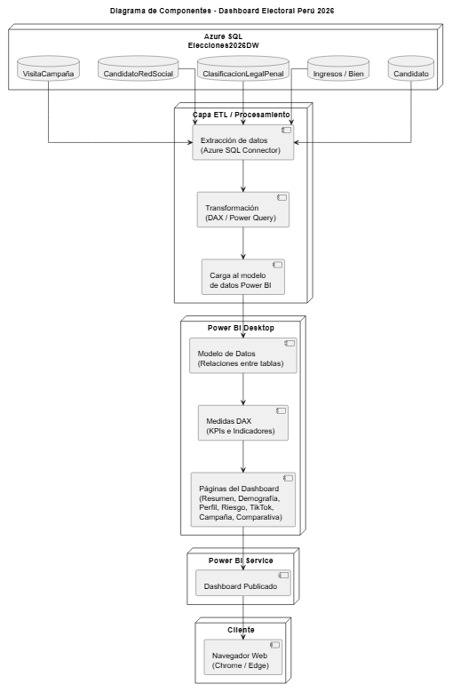
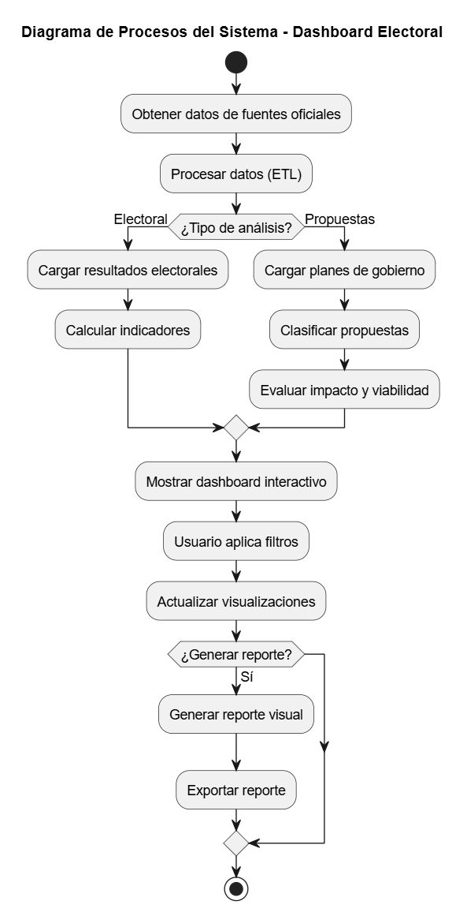
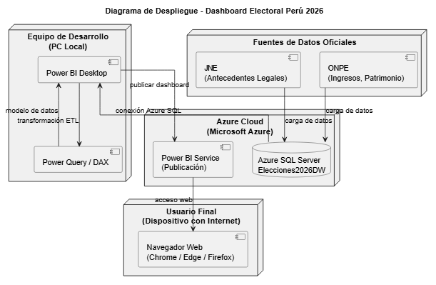

<!-- Archivo generado desde `FD04-EPIS-Informe Arquitectura de Software.docx` para visualizacion en GitHub. -->

**UNIVERSIDAD PRIVADA DE TACNA**

**FACULTAD DE INGENIERIA**

**Escuela Profesional de Ingeniería de Sistemas**

**Proyecto “Dashboard de análisis electoral Perú 2026”**

Curso: Inteligencia de Negocios

Docente: Mag. Patrick Jose Cuadros Quiroga

Integrantes:

**Chura Ticona, Mary Luz (2019065163)**

**Diego Chara Apaza (2019065026)**

**Tacna – Perú**

**2026**

**CONTROL DE VERSIONES**

| Versión | Hecha por | Revisada por | Aprobada por | Fecha | Motivo |
| --- | --- | --- | --- | --- | --- |
| 2.0 | EDCA | MCT | PJCQ | 27/06/2026 | Versión Original |

# Sistema {Nombre del Sistema}

# Documento de Arquitectura de Software

# Versión {2.0}

**CONTROL DE VERSIONES**

| Versión | Hecha por | Revisada por | Aprobada por | Fecha | Motivo |
| --- | --- | --- | --- | --- | --- |
| 1.0 | MPV | ELV | ARV | 10/10/2020 | Versión Original |

**INTRODUCCIÓN**

**Propósito (Diagrama 4+1)**

El propósito del presente documento es describir la arquitectura del sistema Dashboard de análisis electoral y evaluación de planes de gobierno – Perú 2026, utilizando el modelo de vistas arquitectónicas 4+1. Este enfoque permite representar el sistema desde diferentes perspectivas, considerando la vista de casos de uso, vista lógica, vista de implementación, vista de procesos y vista de despliegue.

La arquitectura propuesta tiene como finalidad organizar los componentes principales del sistema, definir la relación entre sus módulos y establecer una base técnica que permita su desarrollo e implementación mediante herramientas de inteligencia de negocios como Power BI. El sistema está orientado a centralizar información electoral, visualizar el perfil de candidatos, analizar ingresos, patrimonio, riesgo legal, presencia en TikTok, campaña y generar reportes visuales.

**Alcance**

El documento de arquitectura comprende la representación estructural y funcional del sistema Dashboard de análisis electoral. Se incluyen las principales vistas arquitectónicas necesarias para comprender cómo se organiza el sistema, cómo interactúan sus componentes y cómo se despliega para su uso.

El alcance considera los siguientes elementos:

Vista de casos de uso del sistema.

Vista lógica mediante paquetes, clases, objetos y secuencia.

Vista de implementación mediante arquitectura de software y componentes.

Vista de procesos mediante diagramas de actividad.

Vista de despliegue físico del sistema.

Atributos de calidad como funcionalidad, usabilidad, confiabilidad, rendimiento y mantenibilidad.

El sistema será desarrollado con fines académicos y estará orientado al análisis del perfil de candidatos presidenciales de las Elecciones Generales Perú 2026 con datos almacenados en Azure SQL, sin integración en tiempo real con sistemas oficiales ni manejo de datos sensibles.

**Definición, siglas y abreviaturas**

Dashboard : Herramienta visual que permite presentar datos mediante gráficos, indicadores y filtros interactivos.

BI : Business Intelligence o Inteligencia de Negocios, conjunto de procesos y herramientas para analizar datos.

Power BI : Herramienta de visualización de datos utilizada para construir dashboards interactivos.

ONPE : Oficina Nacional de Procesos Electorales, fuente oficial de información electoral en el Perú.

RF : Requerimiento funcional del sistema.

RNF : Requerimiento no funcional del sistema.

UML : Lenguaje Unificado de Modelado utilizado para representar diagramas de software.

Vista 4+1 : Modelo arquitectónico que organiza el sistema en diferentes vistas: lógica, procesos, implementación, despliegue y casos de uso.

Indicador : Métrica utilizada para representar resultados electorales o evaluación de propuestas.

Reporte visual : Salida gráfica generada a partir de la información analizada en el dashboard.

**Organización del documento**

El presente documento se encuentra organizado de la siguiente manera:

En el Capítulo 1, se presenta la introducción del documento, el propósito de la arquitectura, el alcance, las definiciones y la organización general.

En el Capítulo 2, se describen los objetivos y restricciones arquitectónicas, considerando los requerimientos funcionales y no funcionales del sistema.

En el Capítulo 3, se desarrolla la representación de la arquitectura del sistema mediante las vistas del modelo 4+1, incluyendo vista de casos de uso, vista lógica, vista de implementación, vista de procesos y vista de despliegue.

En el Capítulo 4, se describen los atributos de calidad del software, considerando funcionalidad, usabilidad, confiabilidad, rendimiento y mantenibilidad.

# OBJETIVOS Y RESTRICCIONES ARQUITECTONICAS

**Priorización de requerimientos**

La priorización de requerimientos permite definir qué funcionalidades del sistema deben ser implementadas primero, considerando su importancia para el cumplimiento de los objetivos del sistema. Esta priorización se basa en el análisis realizado en el documento de requerimientos del sistema Dashboard electoral.

### Requerimientos Funcionales

| Código | Requerimiento Funcional | Descripción | Prioridad |
| --- | --- | --- | --- |
| RF01 | Visualización de resultados electorales interactivos | El sistema mostrará los resultados electorales mediante gráficos dinámicos (barras, tortas y mapas) | Alta |
| RF02 | Filtrado dinámico de datos | El usuario podrá aplicar filtros por candidato, región geográfica y sector de análisis | Alta |
| RF03 | Visualización estructurada de planes de gobierno | El sistema mostrará los planes de gobierno organizados por candidato | Alta |
| RF04 | Clasificación sectorial de propuestas | El sistema clasificará las propuestas en sectores como salud, educación, economía y seguridad | Alta |
| RF05 | Comparación de candidatos y propuestas | El sistema permitirá comparar candidatos en función de resultados electorales y propuestas de gobierno | Alta |
| RF06 | Generación automática de indicadores | El sistema calculará y mostrará indicadores como porcentajes de votos y distribución por región | Alta |
| RF07 | Interacción con dashboard | El usuario podrá interactuar con el dashboard mediante clics, filtros y segmentación de datos | Alta |
| RF08 | Evaluación de propuestas | El sistema permitirá analizar el impacto y viabilidad de propuestas mediante indicadores definidos | Media |
| RF09 | Generación de reportes visuales | El sistema permitirá generar reportes visuales para análisis | Media |

### Requerimientos No Funcionales – Atributos de Calidad

**Cuadro de requerimientos no funcionales**

| Cuadro de requerimientos no funcionales | Cuadro de requerimientos no funcionales | Cuadro de requerimientos no funcionales | Cuadro de requerimientos no funcionales |
| --- | --- | --- | --- |
| Código | Requerimiento No Funcional | Descripción | Prioridad |
| RNF01 | Usabilidad | El sistema debe ser intuitivo y fácil de usar para usuarios sin conocimientos técnicos | Alta |
| RNF02 | Rendimiento | El sistema debe cargar la información en un tiempo menor a 5 segundos | Alta |
| RNF03 | Disponibilidad | El sistema debe estar disponible mediante navegador web | Alta |
| RNF04 | Compatibilidad | El sistema debe funcionar en navegadores modernos (Chrome, Edge, Firefox) | Media |
| RNF05 | Seguridad | El sistema no debe almacenar ni procesar datos personales sensibles | Alta |
| RNF06 | Escalabilidad | El sistema debe permitir la incorporación de nuevos datos electorales | Media |
| RNF07 | Mantenibilidad | El sistema debe permitir actualizaciones sin afectar su funcionamiento | Media |

**Restricciones**

El desarrollo del sistema Dashboard de análisis electoral presenta las siguientes restricciones arquitectónicas:

**Restricciones técnicas**

El sistema será desarrollado utilizando herramientas de inteligencia de negocios como Power BI, Excel y Python.

No se desarrollará como una aplicación web tradicional con backend complejo.

El sistema dependerá de archivos de datos estructurados (datasets).

**Restricciones de datos**

Se utilizarán únicamente datos públicos provenientes de fuentes oficiales como ONPE.

No se permitirá la modificación de datos por parte del usuario final (solo lectura).

**Restricciones operativas**

El sistema estará orientado a uso académico.

No contará con autenticación de usuarios (acceso libre).

El acceso será mediante navegador web.

**Restricciones económicas**

El proyecto debe mantenerse dentro de un presupuesto reducido.

Uso de herramientas gratuitas o licencias académicas.

**Restricciones legales**

Cumplimiento de la Ley N° 29733 – Protección de Datos Personales.

Uso exclusivo de información pública.

# REPRESENTACIÓN DE LA ARQUITECTURA DEL SISTEMA

**Vista de Caso de uso**

La vista de casos de uso describe las funcionalidades principales del sistema desde la perspectiva de los actores que interactúan con él. En el sistema Dashboard de análisis electoral, se identifican tres actores principales: Usuario General, Analista de Datos y Administrador.

Estos actores interactúan con el sistema para realizar operaciones como visualizar resultados electorales, filtrar información, consultar perfil socioeconómico y legal del candidato, comparar candidatos, generar indicadores y reportes visuales. Esta vista permite validar que la arquitectura cubre todos los requerimientos funcionales definidos previamente.

Los casos de uso representan los escenarios clave del sistema, los cuales guían el diseño arquitectónico y permiten identificar los componentes necesarios para su implementación.

### Diagramas de Casos de uso

**Vista Lógica**

La vista lógica representa la estructura interna del sistema, enfocándose en los elementos que permiten cumplir con los requerimientos funcionales. Esta vista incluye la organización en paquetes, clases, objetos y la interacción entre ellos.

El sistema se organiza en módulos principales como:

Gestión de datos (perfil de candidatos desde Azure SQL)

Análisis electoral

Evaluación de riesgo legal y perfil digital

Visualización (dashboard)

Generación de reportes

Estos módulos permiten estructurar el sistema de manera clara, facilitando su desarrollo, mantenimiento y escalabilidad.

### Diagrama de Subsistemas (paquetes)

### Diagrama de Secuencia (vista de diseño)

### Diagrama de Clases

### Diagrama de Base de datos (relacional o no relacional)

**Vista de Implementación (vista de desarrollo)**

La vista de implementación describe cómo se organiza el sistema a nivel de componentes de software, módulos y herramientas tecnológicas utilizadas para construir el dashboard. En este proyecto, la arquitectura se basa en un flujo de datos donde la información de candidatos (ingresos, patrimonio, riesgo legal, TikTok, campaña) es recopilada desde Azure SQL, limpiados, estructurados y posteriormente visualizados mediante Power BI.

El sistema no contempla una aplicación web compleja con backend transaccional, sino una arquitectura orientada a inteligencia de negocios, donde los datos son procesados y transformados para alimentar visualizaciones interactivas.

### Diagrama de arquitectura software (paquetes)

El diagrama de arquitectura software organiza el sistema en cuatro capas principales. La capa de datos contiene los datasets electorales, declaraciones juradas de la ONPE, datos del JNE y base de datos Azure SQL Elecciones2026DW. La capa de procesamiento se encarga de limpiar, transformar y clasificar la información. La capa de análisis genera indicadores electorales, métricas de comparación y evaluación de propuestas. Finalmente, la capa de visualización presenta la información mediante dashboards interactivos, gráficos y reportes visuales en Power BI.

### Diagrama de arquitectura del sistema (Diagrama de componentes)

El diagrama de componentes representa la arquitectura del sistema a nivel de implementación, mostrando los elementos principales que intervienen en el funcionamiento del dashboard. El usuario interactúa directamente con el componente Power BI Dashboard, el cual permite visualizar la información mediante gráficos interactivos y reportes.

El dashboard se conecta con el Modelo de Datos, donde se estructuran los datos previamente procesados. Este modelo es alimentado por el componente Procesamiento ETL, encargado de la extracción, transformación y carga de datos provenientes de diferentes fuentes.

Las principales fuentes de datos incluyen información electoral de la ONPE, planes de gobierno de los candidatos y archivos estructurados como Excel o CSV. Esta arquitectura permite integrar múltiples fuentes, procesarlas y presentarlas de forma clara y organizada en el dashboard.

**Vista de procesos**

La vista de procesos describe cómo el sistema se comporta dinámicamente, mostrando el flujo de actividades y la interacción entre los distintos procesos que permiten el funcionamiento del dashboard. En este sistema, los procesos están orientados principalmente al análisis de datos, desde la carga de información hasta su visualización y generación de reportes.

El sistema no maneja procesos concurrentes complejos, sino un flujo secuencial de procesamiento de datos y visualización, propio de una arquitectura de inteligencia de negocios. Sin embargo, sí existe interacción entre procesos como la carga de datos, el análisis, la aplicación de filtros y la generación de reportes.

### Diagrama de Procesos del sistema (diagrama de actividad)

El diagrama de procesos del sistema representa el flujo general de funcionamiento del dashboard de análisis electoral. El proceso inicia con la obtención de datos desde fuentes oficiales, seguido del procesamiento de la información mediante técnicas de limpieza y transformación (ETL).

Posteriormente, el sistema permite realizar dos tipos principales de análisis: el análisis electoral, donde se cargan resultados y se generan indicadores, y el análisis de propuestas, donde se clasifican las propuestas y se evalúa su impacto y viabilidad. Una vez procesada la información, el sistema presenta los datos mediante un dashboard interactivo.

El usuario puede aplicar filtros para segmentar la información, lo que genera una actualización dinámica de las visualizaciones. Finalmente, el sistema permite generar reportes visuales que pueden ser exportados para su uso posterior.

**Vista de Despliegue (vista física)**

La vista de despliegue representa la distribución física del sistema y muestra los nodos donde se ejecutan sus componentes. En el caso del Dashboard de análisis electoral y evaluación de planes de gobierno - Perú 2026, el sistemase despliega en un entorno web, permitiendo que el usuario acceda al dashboard desde un navegador mediante conexión a internet.

El sistema utiliza fuentes de datos estructuradas, procesamiento de información y visualización mediante Power BI, por lo que su despliegue se apoya en equipos de desarrollo, almacenamiento de datos y un servicio web o cloud para publicación del dashboard.

### Diagrama de despliegue

El diagrama de despliegue muestra la distribución física del sistema. El equipo de desarrollo utiliza Power BI Desktop, archivos Excel/CSV y herramientas de limpieza de datos como Python o Excel para preparar la información electoral y los planes de gobierno. Estos datos son organizados en un repositorio de datos compuesto por el dataset electoral y la información de planes de gobierno.

Posteriormente, el dashboard es construido en Power BI Desktop y publicado en un servicio web o entorno cloud, como Power BI Service. Finalmente, el usuario final accede al dashboard publicado desde un navegador web con conexión a internet, visualizando reportes e indicadores interactivos.

# ATRIBUTOS DE CALIDAD DEL SOFTWARE

.

Escenario de Funcionalidad

La funcionalidad del sistema se evalúa en base a las capacidades que ofrece el dashboard para cumplir con los requerimientos definidos. El sistema permite visualizar resultados electorales, filtrar información, consultar perfil socioeconómico y legal, comparar candidatos, comparar candidatos, generar indicadores y elaborar reportes visuales. Estas funciones garantizan que el sistema cumpla con su propósito principal de facilitar el análisis de información electoral.

Desde el punto de vista de calidad, la funcionalidad está relacionada con la correcta ejecución de las operaciones del sistema, asegurando que los datos sean procesados y representados adecuadamente. Asimismo, se garantiza la integridad de la información, ya que los datos provienen de fuentes oficiales y no son modificados por el usuario final.

Escenario de Usabilidad (RNF01)

La usabilidad del sistema se refiere a la facilidad con la que los usuarios pueden aprender a utilizar el dashboard y comprender la información presentada. En este caso, el sistema está diseñado con una interfaz intuitiva basada en gráficos interactivos, filtros dinámicos y visualizaciones claras.

El usuario puede navegar fácilmente entre las diferentes secciones del dashboard, aplicar filtros y analizar los resultados sin necesidad de conocimientos técnicos avanzados. Además, el sistema minimiza errores mediante una interacción guiada y presenta la información de manera comprensible, lo que mejora la experiencia del usuario, generando confianza y satisfacción.

Escenario de Confiabilidad (RNF05, RNF03)

La confiabilidad del sistema se basa en la capacidad de proporcionar información precisa, consistente y disponible en todo momento. El sistema utiliza datos provenientes de fuentes oficiales, lo que garantiza la integridad de la información.

Asimismo, el sistema está disponible a través de un entorno web, permitiendo su acceso continuo por parte de los usuarios. Al no manejar datos sensibles, se reduce el riesgo de fallas relacionadas con la seguridad. La confiabilidad también implica que el sistema responda correctamente ante errores, mostrando mensajes adecuados en caso de datos incompletos o no disponibles.

Escenario de Rendimiento (RNF02)

El rendimiento del sistema se evalúa en función del tiempo de respuesta y la eficiencia en el procesamiento de datos. El dashboard debe ser capaz de cargar información, aplicar filtros y actualizar visualizaciones en un tiempo menor a 5 segundos.

El uso de herramientas de inteligencia de negocios como Power BI permite optimizar el procesamiento de grandes volúmenes de datos, garantizando una respuesta rápida y eficiente. Esto asegura una experiencia fluida para el usuario, evitando retrasos en la interacción con el sistema.

Escenario de Mantenibilidad (RNF07)

La mantenibilidad del sistema se refiere a la facilidad con la que puede ser modificado, actualizado o mejorado sin afectar su funcionamiento. El sistema permite la actualización de datasets, la modificación de indicadores y la incorporación de nuevas visualizaciones sin necesidad de rediseñar toda la estructura.

Esto facilita su evolución en el tiempo, permitiendo adaptar el dashboard a nuevos procesos electorales, cambios en la información o mejoras en el análisis de datos. La arquitectura modular del sistema contribuye a que estas modificaciones sean realizadas de manera eficiente.

Otros Escenarios (RNF06 – Escalabilidad, RNF04 – Compatibilidad)

El sistema presenta atributos adicionales como escalabilidad y compatibilidad. La escalabilidad permite incorporar nuevos datos electorales, nuevos candidatos o nuevas variables de análisis sin afectar el rendimiento del sistema.

Por otro lado, la compatibilidad garantiza que el sistema funcione correctamente en navegadores modernos como Chrome, Edge y Firefox, permitiendo el acceso desde diferentes dispositivos con conexión a internet.

En conjunto, estos atributos aseguran que el sistema sea adaptable, accesible y capaz de evolucionar según nuevas necesidades.
